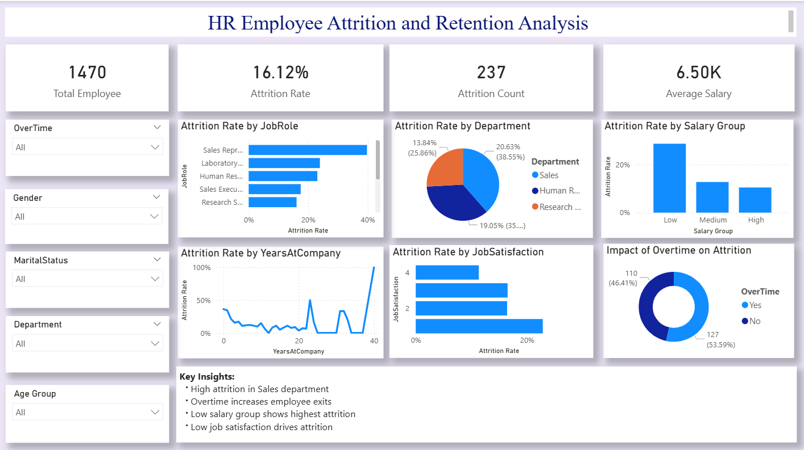

# Employee Attrition Analysis Dashboard

## Project Overview
This project presents an interactive dashboard built with Microsoft Power BI to analyze employee attrition and identify key factors driving turnover. The dashboard provides actionable insights through visualizations and interactive filters, helping HR teams make data-driven decisions.

---

## Dataset
- HR Employee Attrition Dataset

---

## Objective
To create an interactive report answering:  
Why are employees leaving? 

The dashboard allows exploration of attrition trends by:
- Department
- Job Role
- Salary Group
- Job Satisfaction
- Overtime
- Age Group

---

## Tools & Technologies
- Microsoft Power BI  
- Data Cleaning & Transformation  
- Data Visualization

---

## Dashboard Features

### KPI Cards
- Total Employees  
- Attrition Rate  
- Attrition Count  
- Average Salary

### Visualizations
- Attrition Rate by Department  
- Attrition by Job Role  
- Attrition by Salary Group  
- Attrition by Job Satisfaction  
- Attrition by Years at Company  
- Impact of Overtime on Attrition

### Interactive Filters
- Gender  
- Department  
- Age Group  
- Marital Status

---

## Key Insights
- Employees working overtime are more likely to leave  
- Low job satisfaction is linked to higher attrition  
- Sales department exhibits the highest attrition  
- Employees in lower salary groups leave more frequently

---

## Dashboard Preview

---

## Dashboard Demo Video

---

## Conclusion
This dashboard highlights major drivers of employee attrition and provides actionable insights to enhance retention strategies.

---

